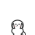

# 线条小狗 · 小白 — Clawd 桌宠主题

> 原创线条风马尔济斯桌宠，灵感来自韩国 Moonlab Studio 的 **线条小狗 Maltese（小白）**，适配 [Clawd on Desk](https://github.com/rullerzhou-afk/clawd-on-desk) 桌面宠物与 Cursor Agent 状态联动。



## 项目亮点（作品集向）

- **AI 产品经理场景**：桌宠实时反映 Cursor Agent 的 thinking / working / error / complete 等状态，让「AI 协作过程」可视化
- **原创 SVG 素材**：8 种状态动画（idle 眼球追踪 + 思考/打字/报错/开心/通知/睡觉/醒来），非官方素材搬运
- **一键安装**：`install.ps1` 复制到 Clawd 主题目录，设置里即可切换

## 版权说明

本主题为 **粉丝向原创作品（Fan Art）**，视觉风格参考线条小狗 IP，**素材均为原创绘制**，与 Moonlab Studio 无官方关联。仅供个人学习、作品集展示与非商用分享。

## 快速开始

### 1. 安装 Clawd on Desk

从 [Clawd Releases](https://github.com/rullerzhou-afk/clawd-on-desk/releases) 下载 Windows 安装包并安装。

### 2. 安装本主题

```powershell
cd "C:\Users\23986\Desktop\maltese-line-pup-theme"
.\install.ps1
```

### 3. 启用主题

打开 Clawd → **设置 → 主题** → 选择 **「线条小狗 · 小白」**。

### 4. 连接 Cursor（可选）

Clawd 支持 Cursor Agent Hook，启动后会自动注册，桌宠会跟随 AI 工作状态变化。

## 主题结构

```
maltese-line-pup-theme/
├── theme.json              # 主题配置
├── assets/
│   ├── maltese-idle-follow.svg   # 待机动画（眼球追踪）
│   ├── maltese-thinking.svg      # AI 思考中
│   ├── maltese-working.svg       # AI 工作中
│   ├── maltese-error.svg         # 出错
│   ├── maltese-happy.svg         # 完成/开心
│   ├── maltese-notification.svg  # 通知
│   ├── maltese-sleeping.svg      # 睡觉
│   └── maltese-waking.svg        # 醒来
├── scripts/generate_assets.py    # SVG 素材生成脚本
└── install.ps1                   # 一键安装
```

## 校验主题

```powershell
node "C:\Users\23986\Desktop\clawd-on-desk\scripts\validate-theme.js" .
```

## 作者

- GitHub: [@159xiaojiu](https://github.com/159xiaojiu)
- 转岗目标：AI 产品经理

## License

原创 SVG 素材 © 159xiaojiu。请勿将本主题用于商业销售或冒充官方周边。
